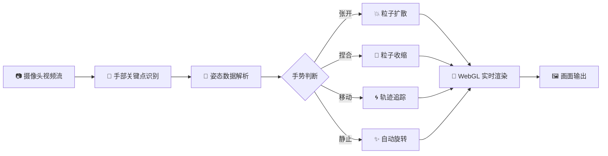
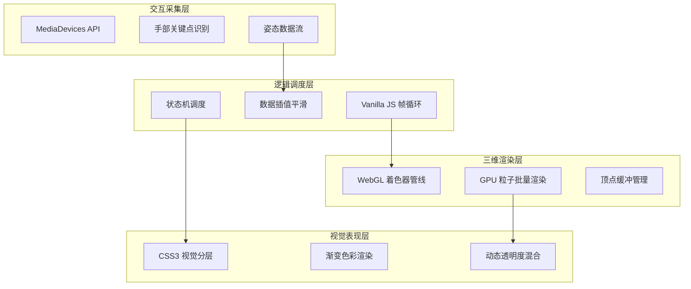

<div align="center">


<br/>


<br/><br/>

> ✨ 当你的指尖在空中划过，三万颗粒子随你的手势起舞 —— 这是属于浏览器的量子粒子宇宙。

**WebGL 实时手势驱动三维粒子可视化渲染系统**
A Real-Time Gesture-Driven 3D Particle Visualization Engine

<br/>

🎮 [在线演示 / Live Demo](#-在线演示) ·
📖 [技术文档](#-技术架构) ·
🚀 [快速开始](#-快速开始)

</div>

---

## 📑 目录

- [🌟 项目亮点](#-项目亮点)
- [🎮 在线演示](#-在线演示)
- [✨ 功能特性](#-功能特性)
- [🛠️ 技术架构](#-技术架构)
- [📦 项目结构](#-项目结构)
- [🚀 快速开始](#-快速开始)
- [🎯 交互指南](#-交互指南)
- [🔧 自定义配置](#-自定义配置)
- [📱 浏览器兼容性](#-浏览器兼容性)
- [❓ 常见问题](#-常见问题-faq)
- [🤝 贡献指南](#-贡献指南)
- [🗺️ 开发路线](#-开发路线)
- [📄 开源协议](#-开源协议)
- [🙏 致谢](#-致谢)

---

## 🌟 项目亮点

| 维度 | 说明 |
|:---:|:---|
| 🚀 极致性能 | 原生 WebGL 着色器管线 + GPU 硬件加速，单文件承载 30,000 颗粒子流畅渲染 |
| 🖐️ 手势驱动 | 浏览器端实时手部关键点识别，毫秒级姿态数据直驱粒子集群动态 |
| 🎨 30 种几何形态 | 内置 30 种程序化生成的三维粒子几何体，一键平滑形变切换 |
| 🌈 霓虹美学 | 渐变色彩混合、动态透明度叠加、辉光视觉，打造赛博朋克级视觉冲击 |
| ⚡ 零依赖 | 纯 Vanilla JS + 原生 WebGL，无 Three.js / 无构建工具 / 无后端 |
| 🖱️ 双模交互 | AI 手势识别加载期间自动降级为鼠标控制，体验无缝衔接 |
| 📦 单文件部署 | 核心逻辑全集成于一个 HTML 文件，克隆即用、开箱即跑 |

---

## 🎮 在线演示

🔴 点击下方链接，授权摄像头权限即可体验手势操控粒子的魅力：

<div align="center">

### 🌐 [https://Aventardo7777.github.io/webgl-gesture-particle-demo/](https://Aventardo7777.github.io/webgl-gesture-particle-demo/)

</div>

> 💡 建议使用 Chrome / Edge 最新版浏览器，并在光线充足的环境下使用，以获得最佳手势识别精度。

---

## ✨ 功能特性

### 🖐️ 手势交互引擎



### 🎨 视觉系统

- **30 种几何形态** — 球体、心形、土星环、螺旋、星系、DNA 双螺旋、立方体阵列……程序化生成，平滑过渡
- **实时色彩定制** — 内置色相选择器，粒子主色调、亮度层次、辉光强度全可控
- **粒子尺寸调节** — 滑块实时控制粒子大小（默认 `0.12`），从星尘到光球自由切换
- **动态混合渲染** — 透明度叠加 + 渐变着色算法，营造深邃空间感

### ⚙️ 系统监控

- 实时 **FPS** 帧率显示
- 粒子对象计数（`OBJ: 30k`）
- 系统初始化状态提示
- AI 模型加载进度反馈

---

## 🛠️ 技术架构

本项目采用**四层分离架构**，每一层职责清晰、独立优化，在保证极致性能的同时维持代码可读性。



### 技术栈一览

| 层级 | 技术 | 选型理由 |
|:---:|:---|:---|
| **三维渲染** | 原生 WebGL 2.0 + GLSL 着色器 | 绕过框架抽象层，直接操控 GPU，极致性能 |
| **手势识别** | MediaDevices API + 手部关键点模型 | 浏览器原生媒体流 + 轻量 AI 推理，零云端依赖 |
| **逻辑调度** | Vanilla JavaScript ES6+ | 无运行时框架开销，`requestAnimationFrame` 精准帧控 |
| **视觉表现** | CSS3 + Canvas 混合分层 | 硬件加速合成，UI 与粒子层独立渲染 |
| **部署架构** | 单 HTML 文件 | 零构建、零依赖、克隆即用 |

---

## 📦 项目结构

```
webgl-gesture-particle-demo/
├── 3d-gesture-particle-system.html   # 🔥 核心文件：渲染引擎 + 手势识别 + 粒子逻辑 + UI 全集成
├── index.html                        # 🚪 入口跳转文件，适配 GitHub Pages 默认访问规则
├── README.md                         # 📖 项目文档（本文件）
└── LICENSE                           # 📄 MIT 开源协议
```

| 文件 | 行数 | 说明 |
|:---|:---:|:---|
| `3d-gesture-particle-system.html` | ~606 行 | 项目唯一整合入口，集成 WebGL 渲染引擎、手势识别模块、粒子运动逻辑、交互控制面板全套代码 |
| `index.html` | ~10 行 | 页面跳转文件，自动重定向至主文件，确保 GitHub Pages 默认路径可正常访问 |

---

## 🚀 快速开始

### 方式一：🌐 在线体验（推荐）

直接访问在线演示地址，授权摄像头即可：

👉 **[https://Aventardo7777.github.io/webgl-gesture-particle-demo/](https://Aventardo7777.github.io/webgl-gesture-particle-demo/)**

### 方式二：💻 本地运行

```bash
# 1. 克隆仓库至本地
git clone https://github.com/Aventardo7777/webgl-gesture-particle-demo.git

# 2. 进入项目目录
cd webgl-gesture-particle-demo

# 3. 直接用浏览器打开主文件（双击即可）
#    或启动本地服务器以获得更稳定的摄像头权限体验：
```

<details>
<summary>📖 可选：启动本地服务器（解决摄像头权限限制）</summary>

> ⚠️ 部分浏览器出于安全策略，仅允许 `https://` 或 `localhost` 访问摄像头。若直接双击打开文件无法授权摄像头，请使用以下任一方式启动本地服务：

```bash
# Python 3
python -m http.server 8000

# Node.js（需全局安装）
npx http-server -p 8000

# PHP
php -S localhost:8000
```

然后在浏览器访问 `http://localhost:8000/3d-gesture-particle-system.html`

</details>

---

## 🎯 交互指南

### 🖐️ 手势操作

| 手势 | 动作 | 视觉效果 |
|:---:|:---|:---|
| 🖐 **张开手掌** | 手掌完全张开 | 粒子扩散爆发，向外辐射 |
| 👌 **捏合** | 拇指与食指捏合 | 粒子收缩聚集，引力效应 |
| 🖐 **移动手掌** | 手掌在空间中移动 | 粒子集群跟随手掌轨迹位移 |
| ✋ **静止** | 手势保持稳定 | 粒子自动缓慢旋转展示 |
| 🔄 **快速切换** | 手势快速开合 | 触发粒子形态动态切换 |

### 🖱️ 鼠标操作（AI 加载期间）

> 在 AI 手势模型加载完成前，系统会自动降级为鼠标控制模式，体验无缝衔接。

| 操作 | 效果 |
|:---|:---|
| **鼠标移动** | 控制粒子集群方向与位置 |
| **左键按住拖动** | 调整粒子形态参数 |
| **滚轮** | 缩放粒子集群整体尺寸 |

### ⌨️ 键盘快捷键

| 按键 | 功能 |
|:---:|:---|
| `F` | 切换全屏模式 |
| `R` | 重置粒子至初始状态 |
| `Space` | 暂停 / 恢复动画 |
| `1` – `9` | 快速切换粒子几何形态分组 |

---

## 🔧 自定义配置

项目内置丰富的可调参数，位于 `3d-gesture-particle-system.html` 顶部的配置区域：

<details>
<summary>⚙️ 可配置参数清单</summary>

| 参数 | 默认值 | 说明 |
|:---|:---:|:---|
| 粒子总数 | `30,000` | 单次渲染的粒子对象数量 |
| 粒子尺寸 | `0.12` | 单个粒子的视觉半径 |
| 几何形态数 | `30` | 内置可切换的三维形态数量 |
| 基础色相 | 青色 | 粒子集群主色调 |
| 辉光强度 | 中 | 粒子边缘发光叠加程度 |
| 旋转速度 | 低 | 无手势时自动旋转速率 |
| 插值平滑 | 高 | 手势数据到粒子运动的插值系数 |

</details>

---

## 📱 浏览器兼容性

| 浏览器 | 最低版本 | WebGL | 摄像头 API | 手势识别 | 综合评级 |
|:---:|:---:|:---:|:---:|:---:|:---:|
| **Chrome** | 90+ | ✅ | ✅ | ✅ | ⭐⭐⭐⭐⭐ |
| **Edge** | 90+ | ✅ | ✅ | ✅ | ⭐⭐⭐⭐⭐ |
| **Firefox** | 88+ | ✅ | ✅ | ⚠️ | ⭐⭐⭐⭐ |
| **Safari** | 14+ | ✅ | ✅ | ⚠️ | ⭐⭐⭐ |
| **Opera** | 76+ | ✅ | ✅ | ✅ | ⭐⭐⭐⭐ |
| **IE** | — | ❌ | ❌ | ❌ | ❌ 不支持 |

> ⚠️ **重要提示**：本项目依赖 WebGL 2.0 与浏览器媒体设备 API，不支持 IE 及任何旧版浏览器。建议始终使用最新版 Chromium 内核浏览器以获得最佳体验。

---

## ❓ 常见问题 (FAQ)

<details>
<summary><b>🔌 摄像头无法授权怎么办？</b></summary>

1. 确认浏览器地址栏左侧的摄像头图标未被禁用
2. 检查系统设置中浏览器是否拥有摄像头访问权限
3. 确保没有其他程序正在占用摄像头
4. 使用 `https://` 或 `localhost` 访问（非 `file://` 协议）
5. 在浏览器地址栏访问 `chrome://settings/content/camera` 检查权限黑名单

</details>

<details>
<summary><b>🤖 AI 手势识别加载很慢？</b></summary>

首次加载需要从 CDN 下载手部识别模型文件，取决于网络环境可能需要 5–15 秒。加载完成后浏览器会缓存模型，后续访问将显著提速。加载期间可使用鼠标交互，体验不受影响。

</details>

<details>
<summary><b>🐌 粒子渲染卡顿如何优化？</b></summary>

1. 关闭浏览器其他占用 GPU 的标签页
2. 在浏览器地址栏访问 `chrome://gpu` 确认 WebGL 硬件加速已启用
3. 降低粒子总数参数（修改配置区 `particleCount`）
4. 更新显卡驱动至最新版本
5. 避免在集成显卡的老旧设备上运行

</details>

<details>
<summary><b>👆 手势识别不准确？</b></summary>

1. 确保环境光线充足，避免逆光
2. 手掌正对摄像头，距离保持在 30–60 厘米
3. 避免背景过于复杂或与肤色相近
4. 确保手掌完整出现在摄像头视野内
5. 单手操作时识别精度通常优于双手

</details>

---

## 🤝 贡献指南

欢迎通过 Issue 和 Pull Request 参与项目共建！

### 提交 Issue

- 🐛 **Bug 反馈** — 详细描述复现步骤、浏览器版本、操作系统
- 💡 **功能建议** — 描述期望的交互效果与使用场景
- 📚 **文档改进** — 指出 README 中表述不清或缺失的部分

### 提交 Pull Request

```bash
# 1. Fork 本仓库

# 2. 克隆你的 Fork
git clone https://github.com/Aventardo7777/webgl-gesture-particle-demo.git

# 3. 创建特性分支
git checkout -b feature/amazing-effect

# 4. 提交修改
git commit -m "feat: 新增粒子爆炸特效"

# 5. 推送并创建 PR
git push origin feature/amazing-effect
```

### 提交规范

| 前缀 | 用途 |
|:---:|:---|
| `feat:` | 新功能 |
| `fix:` | Bug 修复 |
| `perf:` | 性能优化 |
| `refactor:` | 代码重构 |
| `docs:` | 文档更新 |
| `style:` | 格式调整 |

---

## 🗺️ 开发路线

### ✅ 已完成

- [x] 原生 WebGL 粒子渲染引擎
- [x] 实时手部关键点追踪
- [x] 30 种程序化几何形态
- [x] 鼠标降级交互模式
- [x] 实时色彩与尺寸定制
- [x] FPS 性能监控
- [x] 单文件零依赖部署

### 🔜 计划中

- [ ] 多人协同手势交互
- [ ] 自定义粒子形态导入
- [ ] 后期处理：泛光、景深、运动模糊
- [ ] 音频驱动的粒子律动
- [ ] 移动端触摸适配
- [ ] VR / WebXR 沉浸式体验
- [ ] 粒子物理碰撞模拟
- [ ] 录屏与动图导出

---

## 📄 开源协议

本项目基于 [**MIT License**](LICENSE) 开源协议发布。

```
MIT License

Copyright (c) 2024 Aventardo7777

Permission is hereby granted, free of charge, to any person obtaining a copy
of this software and associated documentation files (the "Software"), to deal
in the Software without restriction, including without limitation the rights
to use, copy, modify, merge, publish, distribute, sublicense, and/or sell
copies of the Software, and to permit persons to whom the Software is
furnished to do so, subject to the following conditions:

The above copyright notice and this permission notice shall be included in all
copies or substantial portions of the Software.

THE SOFTWARE IS PROVIDED "AS IS", WITHOUT WARRANTY OF ANY KIND, EXPRESS OR
IMPLIED, INCLUDING BUT NOT LIMITED TO THE WARRANTIES OF MERCHANTABILITY,
FITNESS FOR A PARTICULAR PURPOSE AND NONINFRINGEMENT. IN NO EVENT SHALL THE
AUTHORS OR COPYRIGHT HOLDERS BE LIABLE FOR ANY CLAIM, DAMAGES OR OTHER
LIABILITY, WHETHER IN AN ACTION OF CONTRACT, TORT OR OTHERWISE, ARISING FROM,
OUT OF OR IN CONNECTION WITH THE SOFTWARE OR THE USE OR OTHER DEALINGS IN THE
SOFTWARE.
```

> 允许个人学习、商用二次开发，仅需保留原作者标注。

---

## 🙏 致谢

- 灵感来源于数字艺术与赛博朋克视觉美学
- 感谢 [WebGL 标准组织](https://www.khronos.org/webgl/) 提供的开放图形标准
- 感谢 [MediaDevices API](https://developer.mozilla.org/zh-CN/docs/Web/API/MediaDevices) 让浏览器端实时手势识别成为可能
- 感谢所有探索浏览器创意编程边界的开发者们

---

## ⭐ Star History

<div align="center">

[](https://star-history.com/#Aventardo7777/webgl-gesture-particle-demo&Date)

</div>

---

<div align="center">

**如果这个项目让你眼前一亮，请给一个 ⭐ Star！**


<br/>

<sub>Built with 💜 by [Aventardo7777](https://github.com/Aventardo7777) · Powered by WebGL & Vanilla JS</sub>

<sub>Last updated: 2024</sub>

</div>
